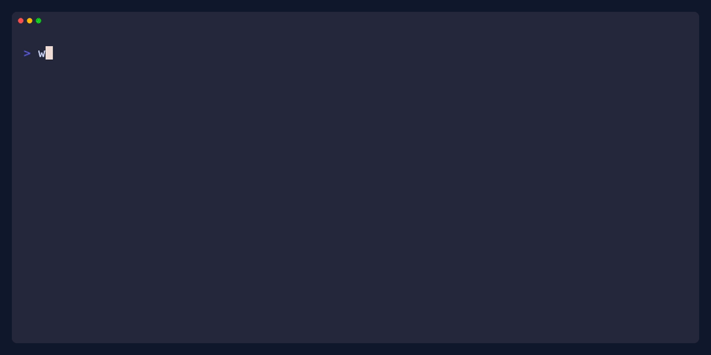
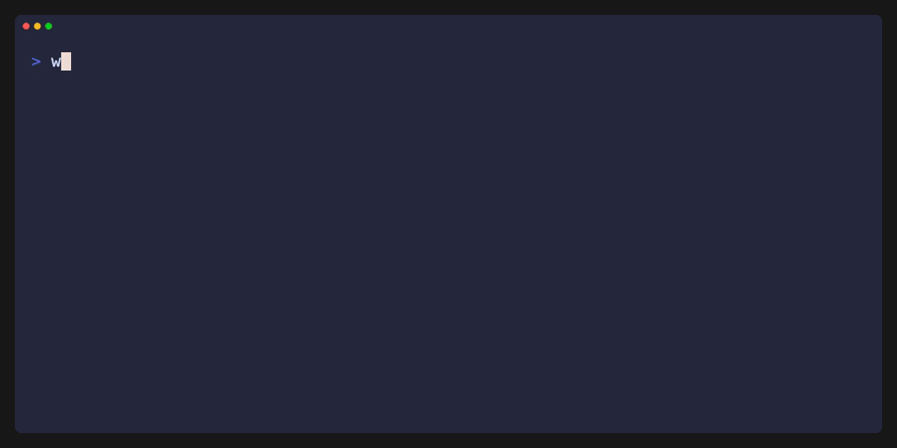

<p align="right"><a href="README.md">🇬🇧English</a> | <a href="README-ja.md">🇯🇵日本語</a></p>

<div align="center">

# wips-cli

**CLI tool for developers' quick memos and lightweight journaling.**

[](https://github.com/rynskrmt/wips-cli/releases)
[](https://opensource.org/licenses/MIT)


[](https://go.dev/)

<p align="center" style="margin: 20px 0;">
    
</p>

</div>

## What is wips-cli?
`wips-cli` is a CLI tool that lets you quickly jot down development memos stored locally. Think of it as your personal development journal.

**wips** is simply the plural form of **WIP** (Work In Progress). It captures the stream of small intermediate states and thoughts during development that are rarely preserved in commit history.

## Requirements

The only requirement is to have `git` installed for the automatic commit capture features.

## Install

You can install `wips-cli` using one of the options listed below.

| Source | Command                                                                                    |
| ------ | ------------------------------------------------------------------------------------------ |
| brew   | `brew install rynskrmt/tap/wips`                                                           |
| scoop  | `scoop bucket add rynskrmt https://github.com/rynskrmt/scoop-bucket && scoop install wips` |
| curl   | `curl -sfL https://raw.githubusercontent.com/rynskrmt/wips-cli/main/install.sh \| sh`      |
| go     | `go install github.com/rynskrmt/wips-cli/cmd/wip@latest`                                   |
| manual | Clone and run `make dev`                                                                   |

## Usage

Simply run it with a message to record a note with auto-detected context (Git repo, branch, directory).

```shell
wip "Refactoring auth logic"
```

## Commands

You can use several commands to manage your notes and view summaries.

```shell
wip [command]
```

Here is the detail for each of the commands

| Command   | Alias | Description                                                              |
| --------- | ----- | ------------------------------------------------------------------------ |
| `summary` | `sum` | Show summary of events within a specified period (daily, weekly, custom) |
| `search`  |       | Search events with natural language date filters and regex               |
| `tail`    | `t`   | Show recent events for the current directory context                     |
| `edit`    | `e`   | Edit an event by ID (default: latest)                                    |
| `delete`  |       | Delete an event by ID (default: latest)                                  |
| `hooks`   |       | Manage git hooks integration to automatically log commits                |
| `config`  |       | Manage global configuration settings                                     |

## Summaries

To view a breakdown of your work for the day, simply run

```shell
$ wip summary   # or: wip sum
```

<p align="center" style="margin: 20px 0;">
    
</p>

You can also check previous days or weeks

```shell
$ wip sum --week       # This week
$ wip sum --last-week  # Last week
$ wip sum --days 3     # Last 3 days
```

### Export Options

You can export summaries to different formats

```shell
$ wip sum --week --format md --out report.md
```

## Search

Search supports natural language dates and powerful filters.

```shell
$ wip search "auth bug" --from "last week"
```

## Recent Activity

Check what you've been doing in the current directory context

```shell
$ wip tail   # or: wip t
```

Use `-g` to see global activity across all projects.

## Git Integration

To enable automatic commit logging, run this inside your repository

```shell
$ wip hooks install
```

Once installed, every `git commit` will be automatically logged to `wips-cli`.

## Configuration

You can omit specific directories from your summaries (e.g. secret projects) by adding them to the hidden list

```shell
$ wip config add-hidden /path/to/secret-project
```

Use `wip config list` to see current settings.

## License

MIT © [rynskrmt](https://github.com/rynskrmt)
